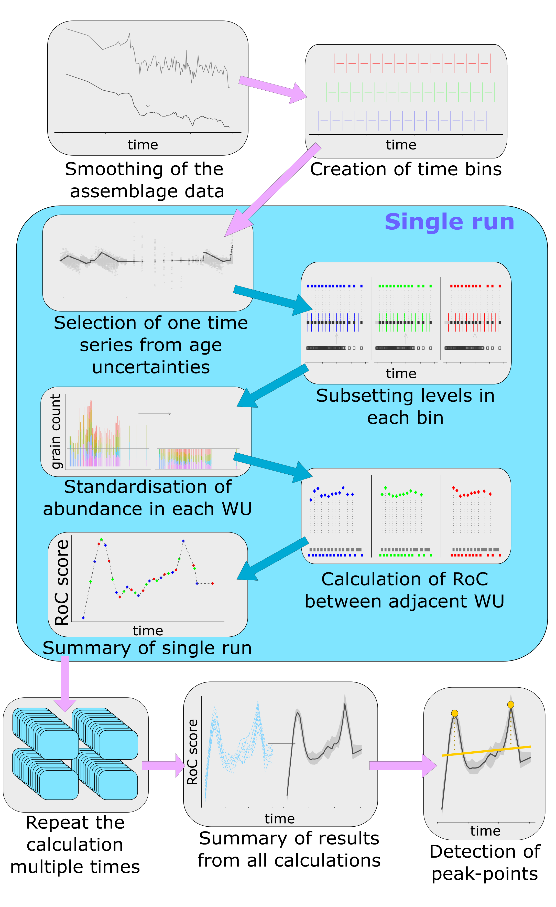

```{r setup, include=FALSE}
knitr::opts_chunk$set(echo = TRUE)
```

# R-Ratepol package

R-Ratepol is an R package for estimating rate of change (RoC) from community data in time series.

Estimation is following several steps:

1. Smoothing of pollen data (smooth each taxon using one of five selected smoothing methods: none, moving average, Grimm’s smoothing, age-weighted average, or Shepard's 5-term filter.

2. Creation of template for all bin brackets in all window movements. 

3. Processes in each single run (an individual loop):
    +	Randomly selection of single age sequence from age uncertainties to all levels
    
    + Creation of working units (WUs) (i.e. subsetting levels in each bin)
    
    + (optional) Data standardisation (subsampling pollen data in each WU to a total number of 150 pollen grains).
    
    + Calculation of the RoC as dissimilarity coefficient (DC) between adjacent WUs (four different dissimilarity coefficients: Euclidean distance, standardised Euclidean distance, Chord distance, Chi-squared coefficient) standardised by age differences between WUs.
    
    + Summary of RoC results from all moving windows 

4.	Repeated the run multiple times (default = 10,000)

5.	Validation and summary of results from all runs; exclude data from beyond the selected time period (i.e. 8000   cal yr BP in this study).


6.	Detection and validation of significant peak points (three ways of testing the significance of individual RoC points: Threshold, Generalized Additive Model (GAM), and Signal-to-Noise index (SNI).



RoC is calculated between consecutive levels or working units (WUs). Traditionally, these WUs represent individual stratigraphical levels. We propose a new method of binning with a moving window, which is a compromise between using individual levels and selective binning. This method follows a simple sequence: bins are created, levels are selected as in selective binning, and RoC between bins is calculated. However, the brackets of time bins (window) are then moved forward by a selected amount of time (Z), levels are selected again, and RoC calculated for a new set of WUs. This is repeated X times (where X is the bin size divided by Z) while retaining all the results 

## Examples

### Instaling package

```{r install, eval=FALSE}
devtools::install_github("HOPE-UIB-BIO/R-Ratepol-package")

```

### Example data

Pollen data from  four European sequences the *Neotoma database* (Goring et al., 2015). Taxa were standardised to the taxonomically highest pollen morphotype (Level = MHVar2) using the pollen harmonisation table in Giesecke et al. (2019). 

Age-depth models were developed using the pre-selected radiometric control points provided in Giesecke et al. (2014) and calibrated the radiocarbon dates using the IntCal13 Northern Hemisphere calibration curve (Reimer et al., 2013). For each sequence,  an age-depth model was constructed using the *Bchron R package* (Haslett & Parnell, 2008) to generate 1000 possible age predictions (i.e. age uncertainties) for all levels. We calculated the median of all the uncertainties for each level to give the most probable age (default age) in calibrated years before present (cal yr BP, where 0 = 1950 CE). 

In each sequence, we excluded all levels that contained less than 150 pollen grain counts of the terrestrial taxa, and all levels beyond a 3000-years extrapolation of the oldest chronological control point. In addition, we excluded all levels with an age older than 8500 cal yr BP to focus on the period of most substantial human impact.

```{r package, results = F, error=F, message=F, warning=F}
library(RRatepol)
library(tidyverse)
```


```{r data, results = T}
example_data = readRDS("example_data/ex_data.rda")

glimpse(example_data)

```
```{r plot data, echo=T}
example_data %>%
ggplot(aes(x=long, y=lat))+
  borders(fill = "gray90", colour = NA)+
  geom_point(shape = 0, size = 2)+
  geom_point(shape = 20, size = 2)+
  coord_quickmap(xlim = c(-10,25), ylim= c(47,70))+
  labs(x= "Longitude",y="Latitude")+
  theme_classic()
```

### Example 1

Estimate RoC values for *Dallican Water* site using *Age-weighed smoothing* of the data and *Chord dissimilarity* coefficient. Pollen data will not standardised to a certain pollen count and age uncertainties from *Bchron* will not be used.  

```{r sequence 1, results = F, warning=F}
sequence_01 = fc_estimate_RoC(example_data$filtered.counts[[1]],
                              example_data$list_ages[[1]],
                              smooth_method = "age.w",
                              DC = "chord",
                              Working_Units = "levels",
                              age_uncertainty = F,
                              standardise = F,
                              rand = 1)


```

```{r plot 1, echo=T}
fc_plot_RoC_sequence(sequence_01, age_treshold= 8e3, Roc_threshold = 0.5, Peaks = F)
```

### Example 2

Now try to standardise pollen data maximum of 150  pollen grains and use age uncertainties from *Bchron*.
Process will be repeated 1000 times on multiple cores using *parallel package*.
This will produce error *wrapper* showing 95th percent quantile.

```{r sequence 2, results = F, warning=F}
sequence_02 = fc_estimate_RoC(example_data$filtered.counts[[1]],
                              example_data$list_ages[[1]],
                              smooth_method = "age.w",
                              DC = "chord",
                              Working_Units = "levels",
                              age_uncertainty = T,
                              standardise = T,
                              N_pollen_grains = 150,
                              rand = 1000,
                              treads = T)


```

```{r plot 2, echo=T}
fc_plot_RoC_sequence(sequence_02, age_treshold= 8e3, Roc_threshold = 2.5, Peaks = F)
```

### Example 3

Use *Binning with the mowing window* approach with `bin_size` = 500 and `Number_of_shifts` = 5. 

```{r sequence 3, results = F, warning=F}
sequence_03 = fc_estimate_RoC(example_data$filtered.counts[[1]],
                              example_data$list_ages[[1]],
                              smooth_method = "age.w",
                              DC = "chord",
                              Working_Units = "MW",
                              bin_size = 500,
                              Number_of_shifts  = 5,
                              age_uncertainty = T,
                              standardise = T,
                              N_pollen_grains = 150,
                              rand = 1000,
                              treads = T)


```

```{r plot 3, echo=T}
fc_plot_RoC_sequence(sequence_03, age_treshold= 8e3, Roc_threshold = 1.5, Peaks = F)
```

### Example 4

Estimate RoC for Glendalough, site with detection op *peak points* using *GAM* method in the last 8000 yr BP.

```{r sequence 4, results = F, warning=F}
age_threshold = 8e3

sequence_04 = fc_estimate_RoC(example_data$filtered.counts[[4]],
                              example_data$list_ages[[4]],
                              smooth_method = "age.w",
                              DC = "chord",
                              Working_Units = "MW",
                              bin_size = 500,
                              Number_of_shifts  = 5,
                              age_uncertainty = T,
                              standardise = T,
                              N_pollen_grains = 150,
                              rand = 1000,
                              Peak_detection = "GAM",
                              interest_threshold = age_threshold,
                              treads = T)


```

```{r plot 4, echo=T}
fc_plot_RoC_sequence(sequence_04, age_treshold= age_threshold, Roc_threshold = 1, Peaks = T, method = "GAM")
```