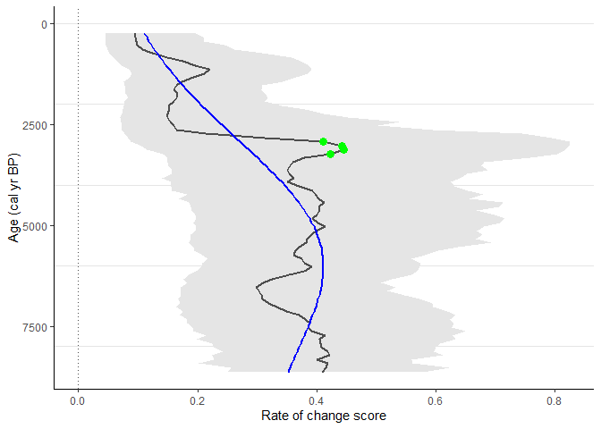

# R-Ratepol package

## Current version: 0.6.0

What is new in the package? See
[NEWS](https://github.com/HOPE-UIB-BIO/R-Ratepol-package/blob/master/NEWS.md)

## Description

R-Ratepol is an R package for estimating rate of change (RoC) from
community data in time series.

Reference: Ondřej Mottl, John-Arvid Grytnes, Alistair W.R. Seddon,
Manuel J. Steinbauer, Kuber P. Bhatta, Vivian A. Felde, Suzette G.A.
Flantua, H. John B. Birks. (2021) Rate-of-change analysis in palaeoecology
revisited: a new approach. 
Review of Palaeobotany and Palynology 293,  doi:
<https://doi.org/10.1016/j.revpalbo.2021.104483>

R-Ratepol is written as an R package and includes a range of possible
settings including a novel method to evaluate RoC in a single
stratigraphical sequence using assemblage data and age uncertainties for
each level. There are multiple built-in dissimilarity coefficients (DC)
for different types of assemblage data, and various levels of data
smoothing that can be applied depending on the type and variance of the
data. In addition, R-Ratepol can use randomisation, accompanied by use
of age uncertainties of each level and taxon standardisation to detect
RoC patterns in datasets with high data noise or variability
(i.e. numerous rapid changes in composition or sedimentation rates).

The computation of RoC in R-Ratepol is performed using the following
steps:

1.  Assemblage and age-model data are extracted from the original source
    and should be compiled together, i.e. depth, age, variable (taxon)
    1, variable (taxon) 2, etc.

2.  (optional) Smoothing of assemblage data: Each variable within the
    assemblage data is smoothed using one of five in-built smoothing
    methods: none (`smooth_method = "none"`), Shepard’s 5-term filter
    (`smooth_method = "shep"`; Davis, 1986; Wilkinson, 2005), moving
    average (`smooth_method = "m.avg"`), age-weighted average
    (`smooth_method = "age.w"`), Grimm’s smoothing
    (`smooth_method = "grim"`; Grimm and Jacobson, 1992).

3.  Creation of time bins: A template for all time bins in all window
    movements is created.

4.  A single run (an individual loop) is computed:

-   (optional) Selection of one time series from age uncertainties (see
    section 2.1.1.2. on randomisation)

-   Subsetting levels in each bin: Here the working units (WU) are
    defined

-   (optional) Standardisation of assemblage data in each WU

-   Calculation of RoC between WUs: RoC is calculated as the
    dissimilarity coefficient (DC) standardised by age differences
    between WUs. Several in-built dissimilarity coefficients are
    available: Euclidean distance (`DC = "euc`), standardised Euclidean
    distance (`DC = "euc.sd`), Chord distance (`DC = "chord`),
    Chi-squared coefficient (`DC = "chisq`; Prentice, 1980), Gower’s
    distance (`DC = "gower`; Gower, 1971), Bray-Curtis(`DC = "bray`).
    The choice of DC depends on the type of assemblage data. In
    addition, RoC between WUs be calculated using every consecutive WU
    (`only_subsequent = FALSE`), or alternatively, calculation of RoC
    can be restricted to only directly adjacent WUs
    (`only_subsequent = TRUE`). Using the former increases the number of
    samples for which RoC can be calculated within a sequence, which
    varies in terms of sample resolution, but may still introduce biases
    related to the RoC estimation as a result of the varying
    inter-sample distances.

-   The summary of a single run is produced based on all moving windows

1.  Step 4 is repeated multiple times (e.g. 10,000 times).

2.  Validation and summary of results from all runs of RoC calculation
    are produced.

3.  (Optional) Data beyond a certain age can be excluded.

4.  Detection and validation of significant peak-points. There are five
    in-built methods to detect significant peak-points: Threshold
    (`method = "threshold`), Linear trend (`method = "trend_linear`),
    Non-linear trend (`method = "trend_non_linear`), first derivative of
    a generalised additive model (`method = "GAM_deriv`; f-deriv GAM;
    Simpson, 2018), and Signal-to-Noise Index (`method = "SNI`; Kelly et
    al., 2011).

## Selection of working units

RoC is calculated between consecutive Working Units (WU). Traditionally,
these WUs represent individual stratigraphical levels. However, changes
in sedimentation rates and sampling strategies can result in an uneven
temporal distribution of levels within a time sequence, which in turn
makes the comparison of RoC between sequences problematic. There are
various methods that attempt to minimise such problems. The first is
interpolation of levels to evenly spaced time intervals, and the use of
the interpolated data as WUs. This can lead to a loss of information
when the density of levels is high. Second is binning of levels:
assemblage data are pooled into age brackets of various size (i.e. time
bins) and these serve as WUs. Here, the issue is a lower resolution of
WUs and their uneven size in terms of total assemblage count (bins with
more levels have higher assemblage counts). Third is selective binning:
like classical binning, bins of selected size are created, but instead
of pooling assemblage data together, only one level per time bin is
selected as representative of each bin. This results in an even number
of WUs in bins with a similar count size in the assemblage. However, the
issue of low resolution remains. Therefore, we propose a new method of
binning with a moving window, which is a compromise between using
individual levels and selective binning. This method follows a simple
sequence: time bins are created, levels are selected as in selective
binning, and RoC between bins is calculated. However, the brackets of
the time bin (window) are then moved forward by a selected amount of
time (Z), levels are selected again (subset into bins), and RoC
calculated for the new set of WUs. This is repeated X times (where X is
the bin size divided by Z) while retaining all the results. R-Ratepol
currently provides several options for selecting WU, namely as
individual levels (`Working_Units = "levels"`), selective binning of
levels (`Working_Units = "bins"`), and our new method of binning with a
moving window (`Working_Units = "MW"`), which is summarised in figure.

## Randomisation

Due to the inherent statistical errors in uncertainties in the age
estimates from age-depth and the assemblage datasets (e.g. pollen counts
in each level; Birks and Gordon, 1985), R-Ratepol can be run several
times and the results summarised (Steps 5-6). Therefore, two optional
settings are available by using age uncertainties and assemblage data
standardisation.

### Age uncertainties (Step 4a)

For each run, a single age sequence from the age uncertainties is
randomly selected. The calculation between two consecutive WUs (i.e. one
working-unit combination) results in a RoC score and a time position
(which is calculated as the mean age position of the two WUs). However,
due to random sampling of the age sequence, each WU combination will
result in multiple RoC values. The final RoC value for a single WU
combination is calculated as the median of the scores from all
randomisations. In addition, the 95th quantile from all randomisations
is calculated as an error estimate.

### Data standardisation (Step 4b)

Variables (taxa) in the assemblage dataset can be standardised to a
certain count (e.g. number of pollen grains in each WU) by rarefaction.
Random sampling without replacement is used to draw a selected number of
individuals from each WU (e.g. 150 pollen grains).

## Detection of peak-points in RoC sequence (Step 8)

A rapid change in composition or relative abundances of variables within
the sequence can provide a means of comparing RoC between sequences and
interpreting the potential drivers of assemblage change. To detect such
significant peak-points of RoC scores in each sequence, each point is
tested to see if it represents a significant increase in RoC values.
There are various ways to detect peak-points in a time series and
R-Ratepol is able to detect peak-points using five methods:

-   Threshold (`method = "threshold`): Each point in the RoC sequence is
    compared to a median of all RoC scores from the whole sequence
    (i.e. threshold value). The ROC value for a point is considered
    significant if the 95th quantile of the RoC scores from all
    calculations is higher than the threshold value.

-   Linear trend (`method = "trend_linear`): A linear model is fitted
    between the RoC values and their ages. Differences between the model
    and each point are calculated (residuals). The standard deviation
    (SD) is calculated from all the residuals. A peak is considered
    significant if it is 1.5 SD higher than the model
    (`sd_threshold = 1.5`).

-   Non-linear trend (`method = "trend_non_linear`): A conservative
    generalised additive model (GAM) is fitted through the RoC scores
    and their ages (GAM= RoC ~ s(age,k=3) using the mgcv package (Wood,
    2011). The distance between each point and the fitted value is
    calculated (residuals). The standard deviation (SD) is calculated
    from all the residuals. A peak is considered significant if it is
    1.5 SD higher than the model (`sd_threshold = 1.5`).

-   F-deriv GAM (`method = "GAM_deriv`): A smooth GAM model is fitted to
    the RoC scores and their ages (GAM= RoC ~ s(age). The first
    derivative as well as continuous confidence intervals are calculated
    from the model using the gratia package (Simpson, 2019). A peak is
    considered significant if the confidence intervals of the first
    derivative differ from 0 (for more information see Simpson, 2018).

-   Signal-to-noise method (`method = "SNI`): We adapted SNI from Kelly
    et al. (2011), which was developed to detect changes in charcoal
    stratigraphical records. SNI is calculated for the whole RoC
    sequence and a peak-point is considered significant if it has an SNI
    value higher than 3.

## Examples

For more detailed example, see [Materials for Seminar Day of PalaeoSIG:
Data Manipulation & Statistical Analysis in
Palaeoecology](https://github.com/OndrejMottl/palaeoR_R-Ratepol_workshop)

### Instaling package

    devtools::install_github("HOPE-UIB-BIO/R-Ratepol-package")

### Example data

Pollen data from four European sequences the *Neotoma database* (Goring
et al., 2015) were obtained. Taxa were standardised to the taxonomically
highest pollen morphotype (Level = MHVar2) using the pollen
harmonisation table in Giesecke et al. (2019).

Age-depth models were developed using the pre-selected radiometric
control points provided in Giesecke et al. (2014) and calibrated the
radiocarbon dates using the IntCal13 Northern Hemisphere calibration
curve (Reimer et al., 2013). For each sequence, an age-depth model was
constructed using the *Bchron R package* (Haslett & Parnell, 2008) to
generate 1000 possible age predictions (i.e. age uncertainties) for all
levels. We calculated the median of all the uncertainties for each level
to give the most probable age (default age) in calibrated years before
present (cal yr BP, where 0 = 1950 CE).

In each sequence, we excluded all levels that contained less than 150
pollen grain counts of the terrestrial taxa, and all levels beyond a
3000-years extrapolation of the oldest chronological control point. In
addition, we excluded all levels with an age older than 8500 cal yr BP
to focus on the period of most substantial human impact.

    library(RRatepol)
    library(tidyverse)

    example_data <-  
      RRatepol::example_data

    glimpse(example_data)
    #> Rows: 4
    #> Columns: 7
    #> $ dataset.id        <chr> "4012", "40951", "45314", "17334"
    #> $ collection.handle <chr> "DALLICAN", "STEERMOS", "KILOALA", "GL"
    #> $ lat               <dbl> 60.38736, 47.80567, 67.96611, 53.00735
    #> $ long              <dbl> -1.096480, 8.200150, 20.460278, -6.348035
    #> $ pollen_data       <list> [<tbl_df[63 x 51]>], [<tbl_df[273 x 104]>], [<tbl_df~
    #> $ sample_age        <named list> [<data.frame[63 x 3]>], [<data.frame[273 x 3]>], [<d~
    #> $ age_uncertainty   <named list> <<matrix[1000 x 63]>>, <<matrix[1000 x 273]>>, <<mat~

    example_data %>%
      ggplot2::ggplot(
        ggplot2::aes(
          x = long,
          y = lat)) +
      borders(
        fill = "gray90",
        colour = NA) +
      geom_point(
        shape = 0,
        size = 2) +
      geom_point(
        shape = 20,
        size = 2) +
      coord_quickmap(
        xlim = c(-10, 25),
        ylim = c(47, 70)) +
      labs(
        x = "Longitude",
        y = "Latitude") +
      theme_classic()

### Example 1

Estimate RoC values for *Dallican Water* site using *Age-weighed
smoothing* of the data and *Chord dissimilarity* coefficient. Pollen
data will not standardised to a certain pollen count and age
uncertainties from *Bchron* will not be used.

    sequence_01 <- 
      RRatepol::fc_estimate_RoC(
        data_source_community = example_data$pollen_data[[1]],
        data_source_age = example_data$sample_age[[1]],
        age_uncertainty = FALSE,
        smooth_method = "shep",
        DC = "chisq",
        Working_Units = "levels",
        standardise = FALSE,
        rand = 1)

    RRatepol::fc_plot_RoC_sequence(sequence_01, Peaks = F, trend = F)

### Example 2

Now try to standardise pollen data in each sample to a maximum of 150
pollen grains and use age uncertainties from *age-depth model*. Process
will be repeated 1000 times on multiple cores using *parallel package*.
This will produce error *wrapper* showing 95th percent quantile.

    sequence_02 <-
      RRatepol::fc_estimate_RoC(
        data_source_community = example_data$pollen_data[[1]],
        data_source_age = example_data$sample_age[[1]],
        age_uncertainty = example_data$age_uncertainty[[1]],
        smooth_method = "shep",
        DC = "chisq",
        Working_Units = "levels",
        standardise = TRUE,
        N_individuals = 150,
        rand = 1000,
        treads = TRUE)

    RRatepol::fc_plot_RoC_sequence(
      data_source = sequence_02,
      Peaks = FALSE,
      trend = FALSE)

### Example 3

Use *Binning with the mowing window* approach with `bin_size` = 500 and
`Number_of_shifts` = 5.

    sequence_03 <-
        RRatepol::fc_estimate_RoC(
        data_source_community = example_data$pollen_data[[1]],
        data_source_age = example_data$sample_age[[1]],
        age_uncertainty = example_data$age_uncertainty[[1]],
        smooth_method = "shep",
        DC = "chisq",
        Working_Units = "MW",
        bin_size = 500,
        Number_of_shifts  = 5,
        standardise = TRUE,
        N_individuals = 150,
        rand = 1000,
        treads = TRUE)

    RRatepol::fc_plot_RoC_sequence(
      data_source = sequence_03,
      Peaks = FALSE,
      trend = FALSE)

### Example 4

Detect the *peak points* using *trend\_non\_linear* method.

    sequence_03_peaks <-
      RRatepol::fc_detect_peak_points(
        data_source = sequence_03,
        method = "trend_non_linear")

    RRatepol::fc_plot_RoC_sequence(
      data_source = sequence_03_peaks,
      Peaks = TRUE,
      trend = "trend_non_linear")

## References

Birks, H.J.B., Gordon, A.D., 1985. Numerical Methods in Quaternary
Pollen Analysis. Academic Press, London.

Davis, J.C., 1986. Statistics and Data Analysis in Geology, 2nd edn.
ed. J. Wiley & Sons, New York.

Gower, J.C., 1971. A general coefficient of similarity and some of its
properties. Biometrics 27, 857–871.

Grimm, E.C., Jacobson, G.L., 1992. Fossil-pollen evidence for abrupt
climate changes during the past 18000 years in eastern North America.
Clim. Dyn. 6, 179–184.

Kelly, R.F., Higuera, P.E., Barrett, C.M., Feng Sheng, H., 2011. A
signal-to-noise index to quantify the potential for peak detection in
sediment-charcoal records. Quat. Res. 75, 11–17.
<https://doi.org/10.1016/j.yqres.2010.07.011>

Prentice, I.C., 1980. Multidimensional scaling as a research tool in
Quaternary palynology: A review of theory and methods. Rev. Palaeobot.
Palynol. 31, 71–104. <https://doi.org/10.1016/0034-6667(80)90023-8>

Simpson, G.L., 2019. gratia: graceful’ggplot’–based graphics and other
functions for GAMs fitted using “mgcv.” R Packag. version 0.2–1.

Simpson, G.L., 2018. Modelling palaeoecological time series using
generalised additive models. Front. Ecol. Evol. 6, 1–21.
<https://doi.org/10.3389/fevo.2018.00149>

Wilkinson, L., 2005. The Grammar of Graphics. Springer-Verlag, New York,
USA 37. <https://doi.org/10.2307/2669493> Wood, S.N., 2011. Fast stable
restricted maximum likelihood and marginal likelihood estimation of
semiparametric generalized linear models. J. R. Stat. Soc. Ser. B Stat.
Methodol. 73, 3–36. <https://doi.org/10.1111/j.1467-9868.2010.00749.x>
