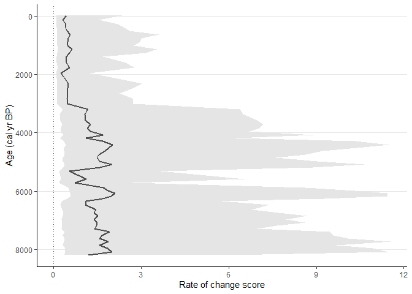
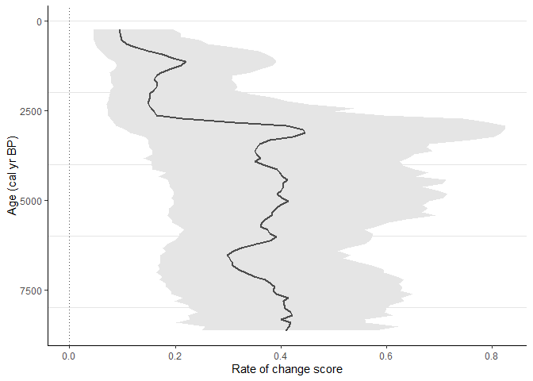

# RRatepol package 

<!-- badges: start -->

[](https://CRAN.R-project.org/package=RRatepol) [](https://github.com/HOPE-UIB-BIO/R-Ratepol-package/actions) <!-- badges: end -->

## Current version: 1.2.1

What is new in the package? See [NEWS](https://hope-uib-bio.github.io/R-Ratepol-package/news/index.html)

### New logo

The original sketch for logo was done by [Vanesa Surtkova](https://www.instagram.com/vavatattoo/). Check her out!

## Description

RRatepol is an R package for estimating rate of change (RoC) from community data in time series.

RRatepol is written as an R package and includes a range of possible settings including a novel method to evaluate RoC in a single stratigraphical sequence using assemblage data and age uncertainties for each level. There are multiple built-in dissimilarity coefficients (dissimilarity_coefficient) for different types of assemblage data, and various levels of data smoothing that can be applied depending on the type and variance of the data. In addition, RRatepol can use randomisation, accompanied by use of age uncertainties of each level and taxon standardisation to detect RoC patterns in datasets with high data noise or variability (i.e. numerous rapid changes in composition or sedimentation rates).

## Installing package

``` r
devtools::install_github("HOPE-UIB-BIO/R-Ratepol-package")
```

## Cite as

``` r
citation(package = "RRatepol")
```

Ondřej Mottl, John-Arvid Grytnes, Alistair W.R. Seddon, Manuel J. Steinbauer, Kuber P. Bhatta, Vivian A. Felde, Suzette G.A. Flantua, H. John B. Birks. Rate-of-change analysis in palaeoecology revisited: a new approach Review of Palaeobotany and Palynology 293, doi: [](https://doi.org/10.1016/j.revpalbo.2021.104483)

## Package website

More detailed information can be found on [RRatepol package website](https://hope-uib-bio.github.io/R-Ratepol-package/)

This include description of the individual steps for RoC estimation [Package Description](https://hope-uib-bio.github.io/R-Ratepol-package/articles/package-description.html)

## Examples

### Workflow

Example of workflow showing full strength of RRatepol package, with as step by step guidance starting from downloading dataset from Neotoma, building age-depth models, to estimating rate-of-change using age uncertainty. [Example of full workflow](https://hope-uib-bio.github.io/R-Ratepol-package/articles/workflow-example.html)

### APD R-Ratepol workshop

For additional examples of RRatepol setting, see [Materials for R-Ratepol workshop with an African focus (APD data users)](https://ondrejmottl.github.io/APD_R-Ratepol_workshop/)

### Build-in example

Pollen data from four European sequences the *Neotoma database* (Goring et al., 2015) were obtained. Taxa were standardised to the taxonomically highest pollen morphotype (Level = MHVar2) using the pollen harmonisation table in Giesecke et al. (2019).

Age-depth models were developed using the pre-selected radiometric control points provided in Giesecke et al. (2014) and calibrated the radiocarbon dates using the IntCal13 Northern Hemisphere calibration curve (Reimer et al., 2013). For each sequence, an age-depth model was constructed using the *Bchron R package* (Haslett & Parnell, 2008) to generate 1000 possible age predictions (i.e. age uncertainties) for all levels. We calculated the median of all the uncertainties for each level to give the most probable age (default age) in calibrated years before present (cal yr BP, where 0 = 1950 CE).

In each sequence, we excluded all levels that contained less than 150 pollen grain counts of the terrestrial taxa, and all levels beyond a 3000-years extrapolation of the oldest chronological control point. In addition, we excluded all levels with an age older than 8500 cal yr BP to focus on the period of most substantial human impact.

``` r
library(RRatepol)
library(tidyverse)
```

``` r
example_data <-  
  RRatepol::example_data

dplyr::glimpse(example_data)
#> Rows: 4
#> Columns: 7
#> $ dataset_id        <chr> "4012", "40951", "45314", "17334"
#> $ collection_handle <chr> "DALLICAN", "STEERMOS", "KILOALA", "GL"
#> $ lat               <dbl> 60.38736, 47.80567, 67.96611, 53.00735
#> $ long              <dbl> -1.096480, 8.200150, 20.460278, -6.348035
#> $ pollen_data       <list> [<tbl_df[63 x 51]>], [<tbl_df[273 x 104]>], [<tbl_df…
#> $ sample_age        <named list> [<data.frame[63 x 3]>], [<data.frame[273 x 3]>], [<d…
#> $ age_uncertainty   <named list> <<matrix[1000 x 63]>>, <<matrix[1000 x 273]>>, <<mat…
```

``` r
example_data %>%
  ggplot2::ggplot(
    ggplot2::aes(
      x = long,
      y = lat)) +
  ggplot2::borders(
    fill = "gray90",
    colour = NA) +
  ggplot2::geom_point(
    shape = 0,
    size = 2) +
  ggplot2::geom_point(
    shape = 20,
    size = 2) +
  ggplot2::coord_quickmap(
    xlim = c(-10, 25),
    ylim = c(47, 70)) +
  ggplot2::labs(
    x = "Longitude",
    y = "Latitude") +
  ggplot2::theme_classic()
```


#### Example 1

Estimate RoC values for *Dallican Water* site using *Age-weighed smoothing* of the data and *Chord dissimilarity* coefficient. Pollen data will not standardised to a certain pollen count and age uncertainties from *Bchron* will not be used.

``` r
sequence_01 <- 
  RRatepol::estimate_roc(
    data_source_community = example_data$pollen_data[[1]],
    data_source_age = example_data$sample_age[[1]],
    smooth_method = "shep",
    dissimilarity_coefficient = "chisq",
    working_units = "levels"
    )
#> #----------------------------------------------------------#
#> ℹ RRatepol started 2023-04-26 12:37:19
#> #----------------------------------------------------------#
#> ℹ RoC will be estimated between individual subsequent levels
#> ℹ 'time_standardisation' = 500 : RoC values will be reported as disimilarity per 500 years.
#> #----------------------------------------------------------#
#> ℹ RRatepol finished 2023-04-26 12:37:20 taking 1.77 secs
#> #----------------------------------------------------------#
```

``` r
RRatepol::plot_roc(
  data_source = sequence_01)
```


#### Example 2

Now try to standardise pollen data in each sample to a maximum of 150 pollen grains and use age uncertainties from *age-depth model*. Process will be repeated 1000 times on multiple cores using parallel computation. This will produce error *wrapper* showing 95th percent quantile.

``` r
sequence_02 <-
  RRatepol::estimate_roc(
    data_source_community = example_data$pollen_data[[1]],
    data_source_age = example_data$sample_age[[1]],
    age_uncertainty = example_data$age_uncertainty[[1]],
    smooth_method = "shep",
    dissimilarity_coefficient = "chisq",
    working_units = "levels",
    standardise = TRUE,
    n_individuals = 150,
    rand = 1000,
    use_parallel = TRUE)
#> #----------------------------------------------------------#
#> ℹ RRatepol started 2023-04-26 12:37:21
#> #----------------------------------------------------------#
#> ℹ 'age_uncertainty' will be used for in the RoC estimation
#> ℹ RoC will be estimated between individual subsequent levels
#> ℹ 'time_standardisation' = 500 : RoC values will be reported as disimilarity per 500 years.
#> ℹ Data will be standardise in each Working unit to 150 or the lowest number detected in dataset
#> #----------------------------------------------------------#
#> ℹ RRatepol finished 2023-04-26 12:39:13 taking 1.87 mins
#> #----------------------------------------------------------#
```

``` r
RRatepol::plot_roc(
  data_source = sequence_02)
```



#### Example 3

Use *Binning with the mowing window* approach with `bin_size` = 500 and `number_of_shifts` = 5.

``` r
sequence_03 <-
    RRatepol::estimate_roc(
    data_source_community = example_data$pollen_data[[1]],
    data_source_age = example_data$sample_age[[1]],
    age_uncertainty = example_data$age_uncertainty[[1]],
    smooth_method = "shep",
    dissimilarity_coefficient = "chisq",
    working_units = "MW",
    bin_size = 500,
    number_of_shifts  = 5,
    standardise = TRUE,
    n_individuals = 150,
    rand = 1000,
    use_parallel = TRUE)
#> #----------------------------------------------------------#
#> ℹ RRatepol started 2023-04-26 12:39:14
#> #----------------------------------------------------------#
#> ℹ 'age_uncertainty' will be used for in the RoC estimation
#> ℹ RoC will be estimated using 'binning with the mowing window' of 500 yr time bin over 5 number of window shifts
#> ℹ Sample will randomly selected for each bin
#> ℹ 'time_standardisation' = 500 : RoC values will be reported as disimilarity per 500 years.
#> ℹ Data will be standardise in each Working unit to 150 or the lowest number detected in dataset
#> #----------------------------------------------------------#
#> ℹ RRatepol finished 2023-04-26 12:44:21 taking 5.12 mins
#> #----------------------------------------------------------#
```

``` r
RRatepol::plot_roc(
  data_source = sequence_03)
```



#### Example 4

Detect the *peak points* using *trend_non_linear* method.

``` r
sequence_03_with_peaks <-
  RRatepol::detect_peak_points(
    data_source = sequence_03,
    sel_method = "trend_non_linear")

RRatepol::plot_roc(
  data_source = sequence_03_with_peaks,
  peaks = TRUE,
  trend = "trend_non_linear")
```


